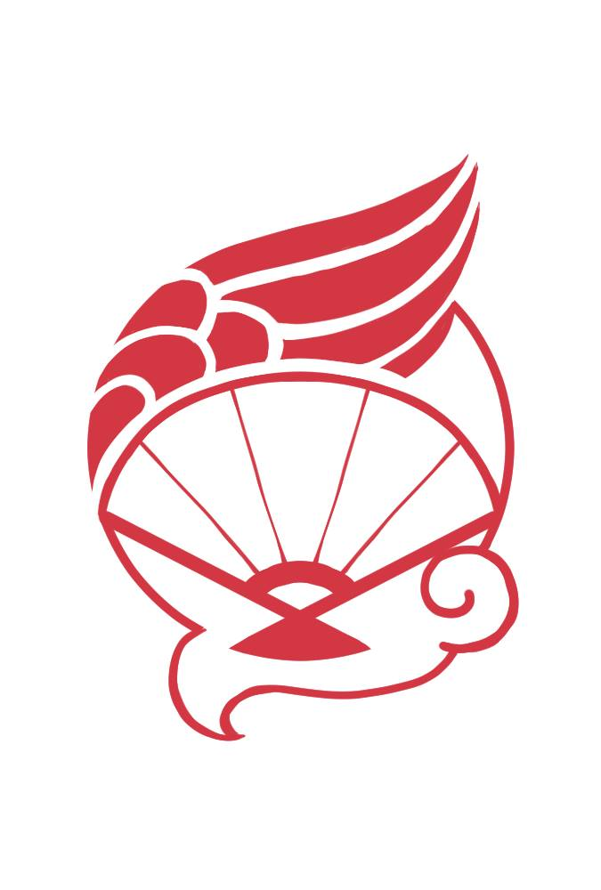
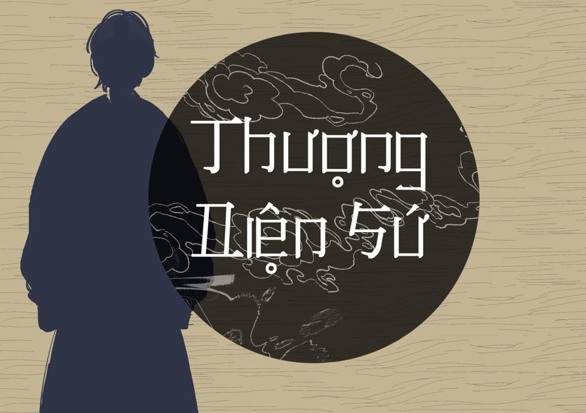
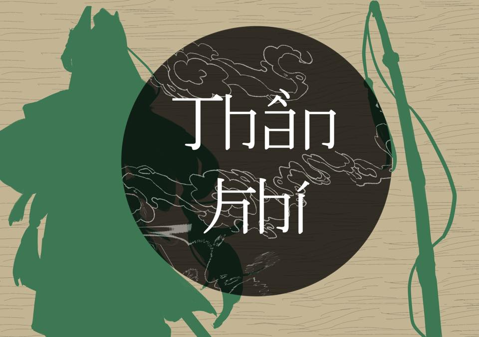
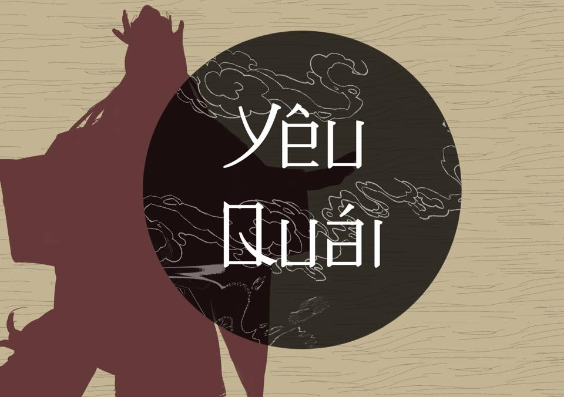

# 🏠 Giới thiệu

> Đây là bản chỉ mục tài liệu liên quan tới văn hóa Việt Nam

> Cập nhật lần cuối: ngày 19, tháng 09, năm 2024

> Liên hệ bổ sung: bình luận trực tiếp vào bài viết [này](https://www.facebook.com/bie.nhd.33/posts/pfbid02rp2zgP1je9298ogFrqjyr6h2ZxEn8VG6NxbT5gLioaSrgxZ2xooYid6FLERk3D2El)

🌟 CREDITS

- How to Vietphuc -- Chử Ly An ( [GGDocs](https://docs.google.com/spreadsheets/d/1ZNYgCEmiDwSxsfbhkpMWcSyVT0PVVKyGX8MgZ8nIrY4/edit#gid=0) | [Facebook Post](https://www.facebook.com/chu.ly.an.ve.vtub/posts/pfbid02NHcjDa8hHFMU932xRvUdM11BmGh6SE92NWTnHa7wL8vkjkUVb2pCLFKXG1At8CD3l)
  )

# 📚 Sách

> Cú pháp: \[Tên sách\] - \[Tên tác giả\]

- 🌟 [1000 QUYỂN SÁCH VIỆT MỘT THỜI VANG BÓNG VỚI 5 PHÚT MỖI NGÀY​](https://docs.google.com/spreadsheets/d/1ACISndQGzHf78aZ_M9nORHKG5vObNWbwFnoH0C8dT9U/edit#gid=58434254)
- 🌟 Ngàn năm áo mũ - Trần Quang Đức
- 🌟 [Giáo trình Cơ sở văn hóa Việt Nam](https://mbn.edu.vn/sach-vui/giao-trinh-co-so-van-hoa-viet-nam-pgs-ts-tran-ngoc-them-pdf/1604/) - Trần Ngọc Thêm --- _giáo trình cho các ngành về văn hóa và ngôn ngữ_
- Việt Nam phong tục - Phan Kế Bính
- Kỹ thuật của người An Nam | Technique du peuple Annamite | Mechanics and crafts of the Annamites - Henri Oger
- Gương phong tục - Đoàn Duy Bình | Hàn lâm điển tịch
- Văn hóa, Tín ngưỡng và thực hành tôn giáo người Việt - Léopold Cadière
- [L'art a Hué Nouvelle edition autorisee - Association des amis du vieux Hué](https://archive.org/details/larthunouvelle00asso)
- An Nam thời xưa - Pierre Pasquier (Toàn quyền Đông Dương) | [Báo Nhân dân](https://nhandan.vn/doc-sach-an-nam-thoi-xua-mot-hinh-dung-song-dong-ve-an-nam-post779457.html)
- Tập tục đời người - Phan Cẩm Thượng | [Goodreads](https://nhandan.vn/doc-sach-an-nam-thoi-xua-mot-hinh-dung-song-dong-ve-an-nam-post779457.html)
- Truyền kỳ mạn lục - Nguyễn Dữ | [Wikipedia](https://vi.wikipedia.org/wiki/Truy%E1%BB%81n_k%E1%BB%B3_m%E1%BA%A1n_l%E1%BB%A5c)
- Vũ Trung Tùy Bút - Phạm Đình Hổ | [Wikipedia](https://vi.wikipedia.org/wiki/V%C5%A9_trung_t%C3%B9y_b%C3%BAt)
- Việt Điện U Linh Tập - Lý Tế Xuyên | [Wikipedia](https://vi.wikipedia.org/wiki/Vi%E1%BB%87t_%C4%91i%E1%BB%87n_u_linh_t%E1%BA%ADp)
- Việt Nam Văn hóa sử cương - Đào Duy Anh | [Bài viết FB](https://www.facebook.com/gioithieusachhaychobantre/posts/pfbid0NStr9NwpH1fkJGrAkEF5ZsviNRCVCy5zRfXv2YHAaGg4JL7Fw9EGdQbxepjqFtULl)

# 💻 Tài liệu trực tuyến

> Các nguồn tư liệu tham khảo có thể được biên soạn, phục chế bởi các tác giả cá nhân, các nhà nghiên cứu, sưu tầm và các tổ chức phi lợi nhuận tâm huyết, vì vậy đôi khi có thể phản ánh ý kiến cá nhân.
>
> _Xin hãy tham khảo và đóng góp xây dựng trong văn hóa và lành mạnh_

- [Phổ_Ngạn《溥彥》](https://twitter.com/_Pho_Ngan) --- y phục và hiện vật cổ
- [Đại Việt Kỳ Nhân](https://www.facebook.com/DaiVietKyNhan) --- danh nhân
- [Cổ Phục Việt Nam 101 - Trần Kiên](https://www.facebook.com/media/set/?set=a.737761963724866&type=3) | [Phần 2](https://www.facebook.com/media/set/?set=a.738128400354889&type=3) --- y phục
- [Pioneering Modern Vietnamese Art: Le Pho’s Journey From the Early Years to 1937 - NICOLAS HENNI-TRINH DUC](https://www.sothebys.com/en/articles/pioneering-modern-vietnamese-art-le-phos-journey-from-the-early-years-to-1937)
- [官家](https://www.facebook.com/lao.tu.5)
- [Great VietNam 大越南](https://www.facebook.com/gr8vietnam)
- [Lược Sử Tộc Việt](https://www.facebook.com/lstvfanpage)
- [Thưởng Hà (Thu Hiền)](https://www.instagram.com/thuongha.vietphuc/) --- y phục
- [Bách Hoa Bộ Hành ](https://www.facebook.com/bachhoabohanh/) | [Instagram](https://www.instagram.com/bachhoabohanh/)
- [Đại Nam Chân Ảnh - 大南真影](https://www.instagram.com/dainamchananh/)
- [artsofvietnam - Mỹ thuật Việt Nam](https://www.instagram.com/artsofvietnam/)
- [vietnamartsleaks Mỹ thuật Việt Nam](https://www.instagram.com/vietnamartsleaks/)
- [La Quốc Bảo ](https://www.facebook.com/baroluo)
- [Quốc Sử Quán](https://quocsuquan92.blogspot.com)
- [Đại Việt Cổ Phong - 大越古風 - VietnamAncient](https://www.facebook.com/daivietcophong) | [Wordpress](https://daivietcophong.wordpress.com) | [Facebook Group](https://www.facebook.com/groups/630359420385614)
- [100 loài yêu tinh quỷ quái Việt Nam ](https://www.facebook.com/groups/234875993668423/posts/926450591177623)
- [YÊU MA QUỶ QUÁI](https://www.facebook.com/yeumaquyquai)
  - [HỒ LY VIỆT](https://www.facebook.com/media/set/?set=a.437072127739408&type=3)
  - [YÊU MA QUỶ QUÁI](https://www.facebook.com/media/set/?set=a.104216451024979&type=3)
- [VIỆT NAM CÓ VĂN HÓA RIÊNG KHÔNG?](https://www.facebook.com/PageNayDichHet/posts/pfbid02BnYyKHybmAHywmEFg5phsXuPHrKB7svTN9oHsoQCZbkYRLtjJ5QyFhTXwreB2Swjl) | [Quora](https://qr.ae/pyQjL5)
- [BỘ SƯU TẬP CỔ VẬT ĐÔNG SƠN, PHÙNG NGUYÊN](https://drive.google.com/drive/folders/1ak3SEdNyjcjk9NkXdSaWperb02BrdOan?usp=sharing)
- [Binh Khí Việt](https://www.facebook.com/BinhkhiVietNam)
- [ĐẠI VIỆT VÕ BỊ](https://www.facebook.com/DaiVietvobi)
- [France Indochine](https://www.facebook.com/FranceIndochine)
- [Huyền Tinh Tác Đấu - 懸星作枓](https://www.facebook.com/huyentinhtacdau)
- [vietphuc_artifacts](https://www.instagram.com/vietphuc_artifacts/)
- [MỘT SỐ ĐỒ ÁN HOA VĂN TRANG TRÍ MỸ THUẬT CỔ HAY GẶP](https://drive.google.com/file/d/10b8BQFPh5kE8k6JdnFHrv3XUN6qfO9xD/view?usp=sharing)
- [Tư liệu môn học mỹ thuật - hung.ha](https://mtcb01.wordpress.com) | [02](https://mtcb02.wordpress.com)
- [vietnamartsleaks](https://www.instagram.com/vietnamartsleaks/)
- [@vintage.vietnamese](https://www.instagram.com/vintage.vietnamese/)
- [@nguyen_dynasty_1802_1945](https://www.instagram.com/nguyen_dynasty_1802_1945/)
- [@vietnameseartinparis](https://www.instagram.com/vietnameseartinparis/)
- [Nguyễn T.A Phong](https://www.facebook.com/profile.php?id=100079904440298) --- nhiếp ảnh
- [Hoa Niên](https://www.facebook.com/Hoanien.concept) | [Tiktok](https://www.tiktok.com/@hoanien.concept) --- trang phục thiết kế

  <iframe src="https://www.facebook.com/plugins/post.php?href=https%3A%2F%2Fwww.facebook.com%2FHoanien.concept%2Fposts%2Fpfbid07NLi5efhjJZbKDq4P7XASF354ixBsmiudTahVgwKKdD4FPU12VvpAqenpCGyGVGol&show_text=true&width=500" width="500" height="0" style="border:none;overflow:hidden" scrolling="no" frameborder="0" allowfullscreen="true" allow="autoplay; clipboard-write; encrypted-media; picture-in-picture; web-share"></iframe>

- [Đa La Xước Phục - 多羅綽服](https://www.facebook.com/dalaxuocphuc)
- [Lê Vũ Quỳnh Mai (Le Cee)](https://www.facebook.com/uncun.pg)
- [Miêu Thái Công và Thác Gia Trang](https://twitter.com/MieuThaiCong)
- [Hồ Đăng](https://twitter.com/vantranbao07)
- [Đại Việt Phong Hoa – 大越豐華](https://daivietphonghoa.wordpress.com)
- [Vietnam Centre](https://www.facebook.com/VietnamCentre)
- [Tiếng Việt giàu đẹp](https://www.facebook.com/tiengvietgiaudep) --- ngôn ngữ
- [Vạn Thiên Y](https://www.facebook.com/vanthieny291/) --- trang phục thiết kế
- [Đông Phong](https://www.facebook.com/dongphongvn)
- [Ảnh chụp tư liệu](https://www.facebook.com/mugwo6666/posts/pfbid0ZtM47pbmxgaqsYHXP3n3X1cgiLBEWRkgMSW7whn3kcPYDcWi75QCJGPYfyJ9mz1Dl) Hoàng thành Thăng Long bởi @mugwo6666
- [Lịch sử Đại Việt](https://www.facebook.com/Historyofdaiviet)
- [Ảnh chụp áo Nhật Bình](https://www.facebook.com/permalink.php?story_fbid=pfbid0iA78n99iHYT2RESjZA9jaGbtoz6CmsDHmenZytz9MR5h8beeZMvC6dN65MYLiKp6l&id=100088438490749) trong bảo tàng, bởi "Ánh Nè"(id=100088438490749)
- [Bộ tranh](https://www.facebook.com/tintucvtv9/videos/1029948004936926) thực hiện bởi họa sĩ Nguyễn Văn Nhân, dưới triều vua Thành Thái, nhà Nguyễn

## Trên tin tức, thời sự chính thức

- [Nỗ lực hồi sinh tranh đỏ](https://www.facebook.com/www.hanoionline.vn/videos/236943312422683/)

## 🌐 Websites

- [Số hóa di sản 3D](https://vr3d.vn/trienlam/) - _hiện vật mô phỏng VR3D_
- [Hoa Văn Đại Việt](https://hoavandaiviet.vn/?fbclid=IwAR18kr0IjygMZJJeO217dWNiAvA_nTJwLEMFtrITeJkRfXSMKcQ87Va_EoQ)

# 🗨️ Cộng đồng

## 👋 Facebook groups

- [Việt Phục Hội](https://www.facebook.com/groups/2440350972853718)
- [Thoại Sử Đàm Lâu](https://www.facebook.com/groups/947255362740012/)
- [Đại Việt Cổ Phong - 大越古風 - VietnamAncient](https://www.facebook.com/groups/630359420385614)
- [Đình làng Việt](https://www.facebook.com/groups/DinhlangVN)
- [Thuở Vàng Son](https://www.facebook.com/groups/521603065452080/)

# 🖊️ Tác phẩm

_Các tác phẩm lấy cảm hứng, gìn giữ, phát huy các nội dung truyền thống. Có thể được dùng làm tài liệu hoặc không._

- [Khoa Phung's Art Corner](https://www.facebook.com/profile.php?id=100092158263628)
- [Font chữ lấy cảm hứng từ hoạ tiết trống Đông Sơn](https://www.facebook.com/graphicdesignVLU/videos/1371043146809379/) | [Thumbnail](img\font-dong-son.png)

## 📚 Truyện tranh

- [Đồng Vọng Dân Gian](https://www.facebook.com/EchoesofTheFolks) - Web | Xuất bản
- [Nam Binh Thần Khí](https://www.facebook.com/NamBinhThanKhi)

## 🌐 Nền tảng / Websites

- [Vietales](https://vietales.vn)

## 🦄 Alternated Universe / AU

---

### HUYỄN VIỆT KỲ ĐÀM

(Facebook: ~~[Page](https://www.facebook.com/macylaitranghuyenvietkydam)~~ Hacked | [Group](https://www.facebook.com/groups/huyenvietkydam) | [Twitter](https://twitter.com/HuyenVietkydam) )

> _Các nội dung và hình ảnh sau đây thuộc về các cá nhân phát triển Huyễn Việt Kỳ Đàm_

> Bài viết giới thiệu: (https://www.facebook.com/groups/huyenvietkydam/posts/3188834364504228/)

#### GIỚI THIỆU

---

**Huyễn Việt kỳ đàm** (Chuyện lạ xứ Huyễn Việt) là dự án tạo OC trên nền tảng Facebook và Twitter dành cho người Việt, với bối cảnh hư cấu được lấy cảm hứng từ lịch sử văn hóa Việt Nam. Vương quốc giả tưởng Huyễn Việt là nơi mà tất cả các chủng loài yêu ma quỷ quái cổ đại sống cùng nhau như xã hội loài người.
Ý tưởng này được thành lập dựa trên dự án tạo OC trên Weibo { Thịnh Đường Dạ Thoại } (Đêm truyện dân gian của nhà Đường) và đã được điều chỉnh sao cho phù hợp với tinh thần văn hóa Việt Nam.

> Credits @ Link { Thịnh Đường Dạ Thoại }: https://weibo.cn/profile/7443600693

<b>Chi tiết thiết lập</b>

#### BỐI CẢNH

---

Vương quốc Huyễn Việt trải qua bề dày lịch sử hơn bốn nghìn năm, đến nay đã bước vào thời kỳ hưng thịnh nhất. Dưới sự cai trị sáng suốt của hoàng triều Nam Huyễn, bốn thế lực trọng yếu trong giang hồ đã quen chung sống hòa bình, nơi nơi đều là cảnh quốc thái dân an.

Thế lực Huyền Long chí lớn tham vọng lớn, dốc lòng cống hiến tài học. Sóng vai còn có Thanh Ly trung nghĩa, dẹp phản trừ loạn làm yên lòng dân chúng. Nhắc Kim Quy thì chính là nơi quy tụ những cá thể tinh tế cẩn thận, thiện về chưởng quản tiền tài thương hội. Cuối cùng, không thể không kể đến các nghệ sĩ Hỏa Phụng đem lại niềm vui khắp chốn.

Vốn tứ phương tự cân bằng lẫn nhau, dẫu có ngầm phân tranh cũng không gây ra biến động lớn. Thế nhưng, với mật hàm vừa nhận được, triều đình e ngại rằng thế lực Huyền Long còn có một kế hoạch khác ...

---

#### THIẾT LẬP CHUNG

- ① Đây là thế giới hư cấu, không sử dụng các yếu tố chính trị lịch sử có thật.
- ② Thể chế chính trị: Phong kiến. Quân chủ chuyên chế, đứng đầu là Vua.
- ③ Thế giới này không có con người. Tuổi nhân vật không được lớn hơn 1500 tuổi.
- ④ Chủng tộc mà người chơi được chọn bao gồm: yêu, ma (quỷ), quái.
  > Chi tiết xem CHỦNG TỘC
- ⑤ Bốn phương Đông - Tây - Nam - Bắc tượng trưng cho nền văn hóa của các thời đại trong lịch sử, qua đó quyết định trang phục của nhân vật.
  > Chi tiết xem NGUYÊN QUÁN
- ⑥ Để tham gia cốt truyện, người chơi được yêu cầu gia nhập một trong bốn thế lực lớn: Huyền Long, Thanh Ly, Kim Quy, Hỏa Phụng.
  > Chi tiết xem THẾ LỰC
- ⑦ Các địa danh và tên riêng được lấy cảm hứng từ thực tế.
- ⑧ Người chơi có thể tự do tạo địa điểm mới, hoặc thành lập các phe phái nhỏ để tương tác với nhau, miễn không dẫn đến mâu thuẫn với thiết lập chính, và không gây ảnh hưởng lớn đến triều đình cùng bốn thế lực lớn. Nếu cố tình vi phạm sẽ bị xem như đối tượng phản loạn và bị diệt trừ.

---

#### CHỦNG TỘC

- Lựa chọn chủng tộc sẽ quyết định các đặc điểm, ngoại hình riêng biệt của nhân vật thuộc về chủng tộc đó.
- Thế giới này không có con người.
- Thần / Thánh / Tiên / Phật >> NPC only.
- Chủng tộc mà người chơi được chọn bao gồm: Yêu, Ma (Quỷ), Quái.

##### ֍ YÊU

① Mô tả: Là động vật, thực vật, hoặc đồ vật tu luyện nhiều năm biến thành.

② Phân biệt: Có thể biến hóa thành dạng người, tuy nhiên vẫn lưu giữ đặc điểm ngoại hình của bản thể. (Ví dụ: tai thú, đuôi thú, vân hoa lá, v.v.)

③ Đặc điểm:

- Thể chất bình thường, bù lại khả năng phép thuật phong phú.
- Kị gương, khi soi sẽ thấy bản thể. Nếu bị gương bát quái chiếu vào sẽ gây đau đớn và lộ nguyên hình.
- Ngoài ra, các loài yêu có thể bị xua đuổi bằng cành dâu.

---

##### ֍ MA (QUỶ)

① Mô tả: Là oan hồn mang chấp niệm, không có thực thể, phải đi chiếm xác để tồn tại.

② Phân biệt: Nước da tái nhợt, tròng mắt đen, móng tay đen, thân nhiệt thấp.

③ Đặc điểm:

- Có khả năng chiếm xác đối tượng khác. Ngoại hình thay đổi tùy theo đối tượng đó.
- Tồn tại càng lâu thì độ cô đặc của thực thể càng cao. => Ma ngàn năm có thể hiện thân.
- Kị sáng và đồ trừ tà (như tỏi, máu gà, v.v.).
- Yếu thì không có thực thể, phải ám ký sinh vật thể .
- Mạnh thì hút máu giết thịt đoạt xác, hoặc gây nghiệt tăng thù hận để mạnh lên.

---

##### ֍ QUÁI

① Mô tả: Là quái vật dị biến riêng biệt, sinh ra đã là quái.

② Phân biệt:Có thể có nhân dạng hoặc không. Ngoại hình có nhiều điểm dị thường, và các bộ phận phi nhân loại. (Ví dụ: nhiều tay chân mắt mũi, hoặc là mọc thêm sừng, v.v. xyz tuỳ các bạn chế biến.)

③ Đặc điểm:

- Thể lực cực tốt, năng lực tấn công mạnh, vua lỳ đòn.
- Muối có thể làm tổn thương cơ thể.
- Có thể xua đuổi quái bằng tỏi hoặc đồ bạc.

#### NGUYÊN QUÁN

> [Bài viết giới thiệu](https://www.facebook.com/groups/huyenvietkydam/permalink/3152781671442831/)

_Mỗi phương lấy cảm hứng từ nền văn hóa của một hoặc vài thời đại trong lịch sử, qua đó quyết định trang phục của nhân vật._

- ֍ ĐÔNG
  > Thời đại: Hùng Vương / Đông Sơn
- ֍ TÂY
  > Thời đại: Lý - Trần - tiền Lê
- ֍ NAM
  > Thời đại: Lê - hậu Lê / Tây Sơn
- ֍ BẮC
  > Thời đại: Nguyễn

TÀI LIỆU DO TÁC GIẢ CUNG CẤP

- Đông Sơn: https://luocsutocviet.com/2018/01/07/053-khao-cuu-ve-trang-phuc-thoi-ky-hung-vuong/
- Lý - Trần: https://yhonsacviet.wordpress.com/2019/05/09/dac-trung-trang-phuc-dan-gian-thoi-ly-tran/
- Lê - Nguyễn: https://spiderum.com/bai-dang/Mot-so-loai-trang-phuc-thoi-Le-Nguyen-c4f
- Tây Sơn - Hậu Lê:
  - https://www.facebook.com/daivietcophong
  - https://hinhanhvietnam.com/trang-phuc-quan-linh-thoi-tay-son/
- Cổ Phục Việt Nam 101

#### BẢN ĐỒ THẾ GIỚI

_Đây là bản đồ giả tưởng dành cho thế giới Huyễn Việt kỳ đàm, vui lòng bỏ qua các yếu tố địa lý thực tế._

##### THIẾT LẬP

① Huyễn Việt là một thế giới độc lập, tại chiều không gian này không tồn tại bất kỳ quốc gia hay lục địa nào khác.

② Đại dương mênh mông không có điểm dừng. Từng có nhiều đại yêu ma quỷ quái thử bay qua biển lớn để tìm đến thềm lục địa khác nhưng đều bỏ mạng giữa biển khơi vì không đủ thể lực.

③ Nhiều sông ngòi chằng chịt, không tiện vẽ hết lên bản đồ nên các bạn tự tưởng tượng nhé.

④ Hoàng thành Đại Nội (hoàng cung) nằm ở phía Bắc Kinh Đô.

⑤ Trụ sở chính của các thế lực chỉ đơn giản là một tòa kiến trúc - nơi hoạt động của nội bộ cao tầng, không phải là một thành thị riêng biệt. Các Thế lực không sở hữu vùng đất riêng nào cả.

⑥ Ngoài những thị trấn đông dân cư tiêu biểu được ghi nhận trên bản đồ, thì vẫn có các làng xã khác rải rác khắp Huyễn Việt.

⑦ Ngoài Trụ sở chính, các Thế lực đều có trạm liên lạc riêng tại Kinh Đô cùng các thị trấn đông dân cư (do NPC đảm nhiệm). Nhân vật có thể truyền tin về Tổng bộ thông qua các kênh này.

⑧ Quần đảo Trường Hoàng: nằm ở vị trí cách chính quốc rất xa, là cơ mật quân sự trực thuộc triều đình. Bất cứ trường hợp xâm nhập bất hợp pháp nào cũng sẽ bị diệt trừ.

---

##### PHÂN BỐ DÂN CƯ

① Cư dân thuộc các thế lực lớn từ bao đời nay vẫn sinh sống hòa bình và trộn lẫn với nhau, trải dài khắp Huyễn Việt.

② Vùng lân cận của Trụ sở thế lực và bên trong Kinh Đô được tính là khu vực đông dân cư.

③ Những khu vực gần Trụ sở chính của bốn thế lực lớn có mật độ tập trung cư dân thuộc thế lực đó nhiều hơn các thế lực khác.

④ Tuy nhiên, không nhất thiết rằng nhân vật thuộc thế lực nào thì phải ở yên chỗ đó. (Ví dụ: Nhân vật thuộc thế lực Kim Quy vẫn có thể sinh sống và làm việc ở vùng lân cận Long Môn).

---

##### ĐỊA ĐIỂM TƯƠNG TÁC

① Người chơi có thể tự do tạo địa điểm mới, miễn không dẫn đến mâu thuẫn với thiết lập chính. (Ví dụ: địa hình núi tuyết chỉ có ở phía Bắc, không có ở phía Nam).

② Các địa điểm tương tác do người chơi tạo ra không được liên quan và gây ảnh hưởng đến Triều đình cùng bốn Trụ sở thế lực. (Ví dụ: không thể tạo hồ sen bên trong Trụ sở hay Hoàng cung).

③ Các địa danh và tên riêng có thể lấy cảm hứng từ thực tế, nhưng không nên dùng tên chính xác, mà hãy đặt lại cho nó một cái tên mới có thể gợi nhớ. (Ví dụ: kinh đô Hoa Lư -> Huyễn Lư).

#### THẾ LỰC

Mỗi phe phái có tuyến nhiệm vụ riêng, góp phần xây dựng cốt truyện.

---

##### ֍ HUYỀN LONG

_Huyền Long là một trong những thế lực lâu đời nhất tại Huyễn Việt. Khác với Thanh Ly, họ không nằm dưới thể chế của triều đình. Trước đây Huyền Long là tập hợp những quan chức + thị vệ có tiếng, tuy vậy do mâu thuẫn với chính quyền lúc bấy giờ, họ tách ra hoạt động riêng lẻ. Mặc dù cho chính sách khác nhau nhưng cả Huyền Long và Thanh Ly đều hướng tới một đất nước Huyễn Việt giàu, mạnh, phát triển. Dù vậy, Huyền Long vẫn không bao giờ bỏ lỡ những cơ hội có thể cà khịa, gây hấn với Thanh Ly._

- Đặc điểm: Tham vọng lớn, học rộng tài cao.
- Thế mạnh: Quyền lực, lý tưởng.
- Lập trường: Có mưu đồ lật đổ chính quyền để thành lập đế chế mới.
- Trụ sở: Long Môn

---

##### ֍ THANH LY

_Thanh Ly là lực lượng trị an lớn nhất của Huyễn Việt, họ chịu trách nhiệm đảm bảo an toàn cho kinh thành cũng như biên giới. Họ đóng vai trò như cánh tay phải đắc lực giúp triều đình đến gần hơn với nhân dân. Những công việc mà chính quyền giao phó thì dù là “ngoài sáng” hay “trong tối”, Thanh Ly trung thành cũng sẽ không phụ lòng chủ nhân. Sự kiên cường, gan dạ của họ chính là mũi giáo mạnh mẽ đại diện cho lý tưởng của Huyễn Việt. Đôi khi họ cũng phải đi dọn dẹp những vấn đề mà các phe phái các gây ra. Huyền Long luôn lấy đó làm mục tiêu để công kích Thanh Ly._

- Đặc điểm: Trung nghĩa, chính trực, kiên cường, gan dạ.
- Thế mạnh: Trật tự, trị an.
- Lập trường: Hoạt động dưới trướng của hoàng thất, cánh tay phải của triều đình.
- Trụ sở: Ly Doanh

---

##### ֍ KIM QUY

_Hội thương nhân độc tôn và duy nhất của Huyễn Việt là Kim Quy. Đã từ rất lâu rồi, lâu đến nỗi người ta quên mất lý do vì sao mà những người này lại xuất hiện. Chỉ biết rằng khi có một phi vụ làm ăn ngon lành nào đó dù to hay nhỏ Kim Quy thương hội cũng nhất định sẽ có mặt ở đó. Một chút gian xảo, thực dụng, nhưng vô cùng quyết đoán chính là những điều mà người ta nhắc tới khi nói về Kim Quy. Họ cũng tự nhận như vậy, rằng bản thân chẳng bay bổng như Hoả Phụng, cũng không trung nghĩa Thanh Ly, lại càng không bó buộc bản thân trong những “mục tiêu” của Huyền Long. Kim Quy sống để phục vụ cho lợi ích của chính bản thân mình và của của thương hội._

- Đặc điểm: Tinh tế, cẩn thận, gian xảo, thực dụng.
- Thế mạnh: Tiền tài, thương hội.
- Lập trường: Trung lập, thiên về lợi ích. Gió theo chiều nào thì nghiêng theo chiều ấy.
- Trụ sở: Quy Các

---

##### ֍ HỎA PHỤNG

_Hoả Phụng như cái tên của họ, nồng nhiệt, đam mê và nóng bỏng. Nếu có nơi nào có thể xua tan mây mù trong bạn thì đó chính là Phụng lâu. Không giống như Huyền Long hết mình vì lý tưởng, Thanh Ly trung thành phụng sự, Kim Quy mê mẩn trước những đồng tiền lấp lánh, Hoả Phụng chỉ đơn giản muốn sống một đời cho ước mơ của họ. Là một chút nghệ thuật nơi nét cọ đưa lên, là một chút trầm lắng khi ngân lên khúc ca da diết, là những tiếng đàn mãi vang vọng. Hoả Phụng là những nghệ sĩ, nghệ nhân chẳng vương chút bụi trong thế giới Huyễn Việt._

- Đặc điểm: Nồng nhiệt, thấu hiểu, đam mê sáng tạo.
- Thế mạnh: Cầm, kỳ, thi, họa.
- Lập trường: Trung lập, hướng về tự do hoạt động nghệ thuật.
- Trụ sở: Phụng Lâu

#### QUY ĐỊNH

---

① Tôn trọng người chơi khác.

- Hãy tìm hiểu về nhân vật bạn sắp tương tác, cố gắng đừng đưa ra những thông tin sai lệch, xuyên tạc về họ.
- Tôn trọng lẫn nhau chính là tôn trọng bản thân mình.
- Đừng autoplay nhân vật khác khi không có sự cho phép của chủ sở hữu.

② Không có ai hoàn hảo.

- Đừng biến nhân vật của mình thành đấng toàn năng hay chúa tể vũ trụ. Ở đây chúng tôi chỉ cần chmúa hmề.
- Không hoan nghênh Mary Sue, Gary Stu.

③ Khi tham gia tương tác: không teencode, xuyên tạc. Hãy giữ gìn sự trong sáng của Tiếng Việt.

④ Nghiêm cấm những vấn đề nhạy cảm liên quan đến chính trị, lịch sử và tôn giáo có thật.

⑤ Trong quá trình tương tác nên bàn luận trước với nhau, tránh trường hợp các bài tương tác mâu thuẫn, không ăn khớp.

⑥ Khi xảy ra xung đột lập tức tìm đến QTV để nhận được sự trợ giúp.

⑦ Khuyến khích sáng tạo lấy cảm hứng từ những tư liệu lịch sử, dân gian, văn học Việt Nam.

⑧ Nghiêm cấm đạo, nhái, trace tranh dưới mọi hình thức.

⑨ Mỗi người chỉ được đăng ký một (1) OC.

⑩ Người chơi không được đăng ký nhân vật liên quan đến hoàng thất, thủ lĩnh phe phái.

HƯỚNG DẪN ĐĂNG Kà OC

> _Vì số lượng đông đảo mà AU này được tự do sử dụng_

D. HƯỚNG DẪN ĐĂNG KÝ OC

---

① Hãy chắc chắn rằng bạn đã đọc kỹ và hiểu rõ về các thiết lập tại các post sau:

- [E. Chủng tộc](#chủng-tộc)
- F. Nguyên quán
- G. Thế lực

② Form đăng ký: [Đã đóng đăng ký]

③ QTV sẽ liên hệ với bạn sớm nhất có thể, mong bạn thông cảm vì tụi mình không thể đáp ứng mốc thời gian 48 giờ như trong hình do số lượng đăng ký đang quá tải.

④ Nếu xét thấy năng lực của nhân vật OP, hay có các đặc điểm mâu thuẫn với thiết lập chính, QTV có quyền không duyệt và yêu cầu bạn chỉnh sửa sao cho phù hợp.

⑤ Một hình mẫu nhân vật OC hợp lệ sẽ do bạn tự vẽ ra, hoặc trực tiếp tham gia vào quá trình sáng tạo (đặt commission / adoptable art, bắt buộc kèm credit tên artist). Không nhận ảnh người thật, không nhận Picrew, không nhận tranh CG có sẵn trên mạng. Hình OC có thể bổ sung trong giới hạn deadline.

⑥ Nhân vật đăng ký hợp lệ khuyến khích full-body, nhằm đáp ứng đủ đặc điểm nhận dạng của chủng tộc.

⑦ Deadline bổ sung hình minh họa cho OC: 30/09/2020

⑧ Sau khi bạn đã bổ sung hình ảnh minh họa OC, QTV sẽ thêm dữ liệu OC của bạn vào album hệ thống dự án (public), các bạn có thể tự do kết nối, tương tác với nhau, và bắt đầu kể câu chuyện của nhân vật.

⑨ Vui lòng post các strip, tranh, truyện của bạn lên Facebook hoặc Twitter cá nhân kèm hashtag: #huyenvietkydam #HuyenVietTales #HuyễnViệtkỳđàm

⑩ Vui lòng dẫn link cho QTV hoặc tag chúng mình để Dự án {Huyễn Việt kỳ đàm} được tổng hợp đầy đủ nhất nhé.

#### CÁC BÀI TƯƠNG TÁC

- TRẠM SE DUYÊN TƯƠNG TÁC: https://www.facebook.com/groups/huyenvietkydam/permalink/3216266308427700/
- GÓC TƯ VẤN: https://www.facebook.com/groups/huyenvietkydam/permalink/3176201015767563/
- CẨM NANG HƯỚNG DẪN NHẬP QUỐC TỊCH HUYỄN VIỆT:
  - https://www.facebook.com/groups/huyenvietkydam/permalink/3168159206571744/
  - https://www.facebook.com/articles/662716279193361/

### Thần Khí

_Nội dung và hình ảnh thuộc quyền sở hữu của các tác giả_

Tác giả: [Thập Nhị](https://www.facebook.com/profile.php?id=100027797661499) | [Lại Khánh](https://www.facebook.com/khanh.lai.37819) | [Võ Hoàng Yến](https://www.facebook.com/banhxeo.yenhoangnguyen)

> Bài giới thiệu AU: https://www.facebook.com/permalink.php?story_fbid=pfbid0fJYrXYDGE6v4AM9uksshjRU2aUULfSEu8HXy1zCQSzJ36VnRfqZFiNWsEQL7gkiJl&id=100027797661499

Với bối cảnh tại đất nước Sơn Việt, AU Thần Khí đưa bạn đến một câu truyện:
Thuở xưa, loài người luôn phải sống trong nỗi sợ hãi vì ma quỷ hoành hành. Chúng mang trong mình thứ sức mạnh điên cuồng hỗn loại mà không một phàm nhân nào có thể tưởng tượng nổi. Nhân loại muốn sống, họ cầu xin Thần Linh cứu vớt họ khỏi bờ vực diệt vong, bởi lẽ ấy Thần Linh đã ban cho những người được chọn, những Thượng Diện Sứ thứ vũ khí có sức mạnh và lý trí để chống lại yêu ma quỷ quái gọi là Thần Khí.
Yêu cầu người chơi:

- Trang phục là Việt phục hoặc Việt phục cách tân.
- Vũ khí, đồ vật thuộc thế kỉ thứ 18 của Việt Nam trở xuống, có thể fantasy nhưng không thể chọn đồ hiện đại.
- Không mary sue nhân vật.

- Hashtag: [#Thần_Khí_AU](https://www.facebook.com/hashtag/th%E1%BA%A7n_kh%C3%AD_au)
- Cộng đồng: - [Facebook Group](https://www.facebook.com/groups/135056756346282/) | [Discord](https://discord.com/invite/cvAegd2gQe)

<b>Chi tiết thiết lập</b>

#### Thượng Diện Sứ

kẻ được Thần Khí lựa chọn. Trên cơ thể Thượng Diện Sứ có Thiên Ấn của Thần Khí, được Thần Khí ban sức mạnh và có sứ mệnh tiêu diệt ma vật. Thượng Diện Sứ có thể là bất cứ ai, bất cứ tầng lớp nào, chỉ cần có cơ duyên gặp và được Thần Khí chọn, họ buộc phải đi trên con đường đối đầu với bóng tối.

- Đa dạng giai cấp, tuổi tác

- Trên cơ thể có Thiên Ấn màu đỏ, tuỳ vào đặc trưng của Thần Khí thì Thiên Ấn sẽ có hình dạng khác nhau.

- Thượng Diện Sứ có thể trà trộn sinh sống như thường dân, hoặc công khai trở thành người diệt yêu cho một tổ chức (hoàng gia, địa chủ, phú hào)

#### Thần Khí

đồ vật được ban linh khí. Mỗi Thần Khí khi có ý thức đều phải hiểu được lí do nó sinh ra vì mục đích gì. Hoàn toàn tuân lệnh chủ nhân, biết được thứ cần giết là ai.

- Chỉ khi chọn được chủ nhân, Thần Khí mới thực sự biến hoá trở thành Thần Khí. Trước đó chúng sẽ ở trạng thái vũ khí bình thường dù có truyền tay bao nhiêu người.

- Thần Khí có thể biến thành dạng người, đồ vật, con vật, v…v Thần khí sẽ trở nên mạnh mẽ hơn khi sát cánh cùng chủ nhân của mình.

- Nếu chủ nhân mất, Thần Khí quay trở lại trạng thái vũ khí bình thường, chờ đợi người chủ tiếp theo nó chọn.

- Thần Khí ban cho chủ nhân linh khí và chính chúng cũng có linh khí. Chỉ có linh khí mới có thể thanh tẩy được ma vật.

- Thần Khí không giới hạn trong phạm vi vũ khí, chúng có thể là những vật dụng như quạt, sáo, vân vân.

- Điểm yếu của Thần Khí sẽ do người chơi tự chọn. Thần Khí bắt buộc phải có một điểm yếu.

- Thần Khí cũng có thể bị ảnh hưởng bởi chướng khí quá mạnh đến từ ma vật.

#### Yêu quái

- Đa dạng chủng loài.
- Đa dạng sức mạnh.
- Đa dạng tư duy và lí tính, không bị bó buộc trong khuôn khổ tốt hay xấu.
- Không mary sue vì chắc chắn tất cả yêu quái đều bị khắc chế và giết chết bởi linh khí của Thần Khí

#### Hỏi đáp

> [Bài viết hỏi đáp](https://www.facebook.com/permalink.php?story_fbid=pfbid02hyQeSTtRPDMFaxMrpKtaAmU4BJjC4E65YuipBMKGv1wAAQVYsyMCZZK7i1xmHbWjl&id=100027797661499)

1. Thần Khí có thể được sử dụng bởi yêu quái không?
   > Câu trả lời là hoàn toàn không thể nhé. Cơ chế của Thần Khí là cho người sử dụng Linh Khí - thứ mà khắc và có khả năng thanh tẩy ma khí. Vì vậy nếu một yêu quái làm chủ Thần Khí thì ngay lập tức yêu quái ấy sẽ bị thanh tẩy và chết.
2. Thần Khí có bao nhiêu dạng biến hoá?
   > Thần Khí có 3 dạng biến hoá: dạng thứ nhất là vũ khí bình thường (khi Thần Khí chưa chọn được chủ nhân hay còn gọi là vô chủ), dạng thứ 2 là Thần Khí (khi nó đã chọn được chủ nhân), là cuối cùng là dạng sinh vật sống (thú, người, người thú). LƯU Ý một Thần Khí người chơi chỉ được chọn một trong ba loại tại dạng sinh vật sống.
3. Thượng Diện Sứ sử dụng Thần Khí như nào?
   > Thượng Diện Sứ có thể sử dụng Thần Khí trực tiếp bằng nguyên hình của Thần Khí. Hoặc Thượng Diện Sứ chỉ là người ra lệnh thông qua Thiên Ấn để Thần Khí tự hoá thành dạng sinh vật sống để chiến đấu (đây là lí do mà Thần Khí có dạng sinh vật sống nêu ở câu hỏi trên).
4. Thượng Diện Sứ được sở hữu bao nhiêu Thần Khí?
   > Mỗi Thượng Diện Sứ chỉ được sở hữu một Thần Khí. Nhưng vẫn có trường hợp Thần Khí đi theo một cặp như song đao, côn nhị khúc, song thương vân vân...

#### Tư liệu bổ sung tác giả cung cấp

- [Bài viết #1](https://www.facebook.com/permalink.php?story_fbid=pfbid0TtqzgLdhPuvPnecxMw3mtNqjLLr8qgJZnRzMCApb2gLPDWZ8g2W1J2mYV3ePwJiLl&id=100027797661499)
- [Bài viết #2](https://www.facebook.com/banhxeo.yenhoangnguyen/posts/pfbid0SSKLPUU8qfjqf3QywPii5n72EN2YqfwafmdKpzK5kvs8Asxc6B1GqzqLpzfPS52hl)

## Game

- [Nam Binh Thần Khí](https://www.facebook.com/NamBinhThanKhi)
- [Đại Việt Kỳ Nhân](https://www.facebook.com/DaiVietKyNhan)
